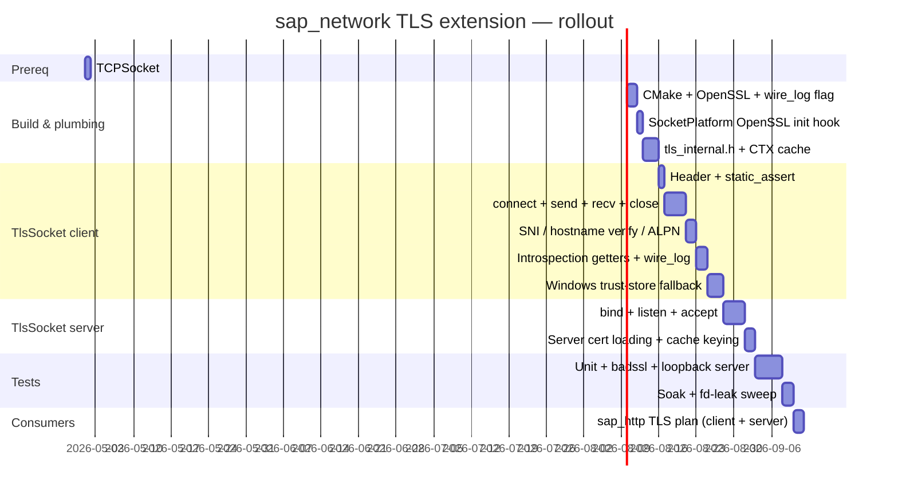

# sap_network — TLS Extension Plan

**Status:** Draft v2.1 (concept-based `Socket` + `stl::result` I/O, client + server, no pimpl).
**Owner:** Nobu
**Scope:** Add `sap::network::TlsSocket` to `sap_network` as a concrete value
type that satisfies the `Socket` concept, on top of OpenSSL, cross-platform
for Linux and Windows (MSVC). Supports client and server roles.

---

## 1. Goals and Non-Goals

### Goals

- A `TlsSocket` class that satisfies `sap::network::Socket` — same
  `connect`/`send`/`recv`/`close`/`valid`/`config` surface as `TCPSocket`,
  same blocking semantics, same timeout knobs — but negotiates TLS 1.2/1.3
  during `connect()` (client) or `accept()` (server) and transparently
  encrypts/decrypts on `send()`/`recv()`.
- **Client and server roles.** Clients call `connect()` (TCP connect + TLS
  handshake as initiator). Servers call `bind()`/`listen()` then `accept()`,
  which returns a `TlsSocket` already through the server-side handshake.
  `sap_http` is the driving consumer of the server path.
- Built on OpenSSL 3.0+ on both Linux (system package or vcpkg) and Windows
  (vcpkg).
- Hostname verification, SNI, and ALPN supported. Peer certificate
  verification on by default against the OS trust store (client role).
- Concept-based substitutability: any `template <Socket S>` consumer (see
  `sap::network::request<S>` in
  [include/sap_network/socket_concept.h](../include/sap_network/socket_concept.h),
  future `HttpClient<S>`) accepts `TCPSocket` or `TlsSocket` without changes.
- Stack-allocable, move-only, value semantics — matches TCP/UDP. No pimpl;
  follow the same pattern as the rest of `sap_network` — opaque
  forward-declared handles in the public header, OpenSSL includes confined
  to `src/tls_internal.h` + `src/tls_socket.cpp`.
- Error detail via `stl::result<size_t>` on `send`/`recv` — the whole
  `sap_network` surface carries its own error string; `TlsSocket` inherits
  that shape.
- **Debug wire logging** for inspecting decrypted bytes during protocol
  development. Gated on `SAP_TLS_WIRE_LOGGING` (auto-enabled for Debug
  builds, opt-in in Release). Zero footprint when disabled.

### Non-Goals (for this phase)

- Mutual TLS / client certificates. API leaves room for it but MVP is
  server-cert verification only on the client side, any-client-accepted
  on the server side.
- Kernel-bypass, DTLS, or QUIC.
- BoringSSL, mbedTLS, or SChannel backends. OpenSSL only, to keep one
  codebase.
- Async I/O. `TlsSocket` is blocking just like `TCPSocket`.
- Reintroducing runtime polymorphism. If a consumer truly needs to pick
  TCP vs TLS at runtime, use `std::variant<TCPSocket, TlsSocket>` at the
  boundary; do not resurrect `ISocket`.

---

## 2. API Sketch

House conventions: `stl::` containers, `stl::result<>` where fallible,
`m_snake_case` members, `E` prefix on enums, snake_case functions, `.h`/`.cpp`
extensions. OpenSSL headers stay out of the public interface via
forward-declarations of the opaque C structs (`ssl_st`, `ssl_ctx_st`) —
same pattern as `SocketHandle` hiding Winsock in
[include/sap_network/platform.h](../include/sap_network/platform.h).

### 2.1 New header: `include/sap_network/tls_socket.h`

```cpp
#pragma once

#include "sap_network/platform.h"
#include "sap_network/socket_concept.h"
#include "sap_network/socket_config.h"
#include "sap_network/tcp_socket.h"

#include <sap_core/stl/result.h>
#include <sap_core/stl/string.h>
#include <sap_core/stl/vector.h>
#include <sap_core/types.h>

#include <chrono>
#include <functional>

// Forward-declare OpenSSL's opaque types. Defined in <openssl/ssl.h>, which
// stays private to src/tls_socket.cpp — callers see only pointers.
struct ssl_st;
struct ssl_ctx_st;

namespace sap::network {

    enum class ETlsRole { Client, Server };

    struct TlsConfig {
        // Underlying TCP configuration. TlsSocket owns a TCPSocket by value.
        SocketConfig tcp;

        ETlsRole role = ETlsRole::Client;

        // --- Client-side knobs (ignored when role == Server) ----------------
        // SNI hostname sent during handshake. If empty, uses tcp.host.
        stl::string sni_hostname;
        // Verify the peer presented a certificate chaining to a trusted root.
        bool verify_peer = true;
        // Verify the peer's cert matches sni_hostname (or tcp.host if empty).
        bool verify_hostname = true;
        // Optional explicit CA bundle file (PEM). Falls back to ca_dir then OS store.
        stl::string ca_file;
        // Optional explicit CA directory (hashed certs, OpenSSL layout).
        stl::string ca_dir;
        // Optional client cert + key for mutual TLS. Both set or both empty.
        stl::string client_cert_file;
        stl::string client_key_file;

        // --- Server-side knobs (ignored when role == Client) ----------------
        // Path to server certificate chain (PEM). Required for Server role.
        stl::string server_cert_file;
        // Path to server private key (PEM). Required for Server role.
        stl::string server_key_file;

        // --- Shared knobs ---------------------------------------------------
        // ALPN protocols. On client: offered in preference order. On server:
        // selected from the client's offer in this preference order.
        stl::vector<stl::string> alpn_protocols;
        // Minimum acceptable protocol version. Defaults to TLS 1.2.
        enum class EMinVersion { TLS_1_2, TLS_1_3 };
        EMinVersion min_version = EMinVersion::TLS_1_2;

#ifdef SAP_TLS_WIRE_LOGGING
        // Debug hook, compiled in only when SAP_TLS_WIRE_LOGGING is defined
        // (auto-enabled in Debug builds; see §4). Called once per successful
        // send / recv with the decrypted plaintext. Empty by default = no-op.
        enum class EWireDirection { Send, Recv };
        std::function<void(EWireDirection, stl::span<const stl::byte>)> wire_log;
#endif
    };

    class TlsSocket {
    public:
        explicit TlsSocket(TlsConfig config);
        ~TlsSocket();
        TlsSocket(const TlsSocket&) = delete;
        TlsSocket& operator=(const TlsSocket&) = delete;
        TlsSocket(TlsSocket&&) noexcept;
        TlsSocket& operator=(TlsSocket&&) noexcept;

        // Socket concept surface (mirrors TCPSocket's common methods).
        bool connect();                                            // Client: TCP connect + SSL_connect + verify.
        stl::result<size_t> send(stl::span<const stl::byte> data); // SSL_write.
        stl::result<size_t> recv(stl::span<stl::byte> data);       // SSL_read; 0 = peer-closed.
        void close();                                              // SSL_shutdown → TCP close.
        bool valid() const;
        const SocketConfig& config() const { return m_config.tcp; }

        // Server-side additions (beyond the Socket concept).
        bool bind();                       // Delegates to m_tcp.
        bool listen();                     // Delegates to m_tcp.
        stl::result<TlsSocket> accept();   // TCP accept + SSL_accept. Inherits server config.

        // Timeouts apply to the underlying TCP layer; TLS inherits them.
        void set_recv_timeout(std::chrono::milliseconds ms);
        void set_send_timeout(std::chrono::milliseconds ms);

        // Post-handshake introspection. Empty until handshake completes.
        stl::string negotiated_protocol() const;      // ALPN result, e.g. "http/1.1".
        stl::string negotiated_cipher() const;        // e.g. "TLS_AES_256_GCM_SHA384".
        stl::string negotiated_tls_version() const;   // e.g. "TLSv1.3".
        stl::string peer_cert_subject() const;        // Client: server's cert. Server: client's cert if present.
        stl::string peer_cert_issuer() const;

        // Detail for the most recent connect()/accept() failure. Empty when
        // the handshake succeeded or hasn't run. Populated from the OpenSSL
        // error stack. send/recv errors live in their own result<>.
        stl::string handshake_error() const { return m_handshake_error; }

    private:
        // Private constructor used by accept() to wrap a freshly-accepted
        // server-side TCP connection + its SSL*.
        TlsSocket(TCPSocket tcp, ssl_st* ssl, TlsConfig config);

        ssl_st* m_ssl = nullptr;    // Opaque; defined by OpenSSL in tls_socket.cpp.
        TCPSocket m_tcp;            // Owns the underlying socket.
        TlsConfig m_config;
        stl::string m_handshake_error;
    };

    // Compile-time check: TlsSocket satisfies the common Socket concept.
    static_assert(Socket<TlsSocket>);

} // namespace sap::network
```

Note on `connect()` returning `bool` rather than `stl::result<>`: the `Socket`
concept requires `connect()` to be `std::convertible_to<bool>`, and
`stl::result<>::operator bool()` is `explicit`, so a result-returning
`connect()` would fail the concept check. `handshake_error()` covers the
"why did it fail" case. If `sap_network`-wide `connect()` is ever widened to
`stl::result<>`, the concept changes with it and `handshake_error()` folds in.

### 2.2 Private header: `src/tls_internal.h`

Follows the same shape as
[src/socket_internal.h](../src/socket_internal.h) — confines OpenSSL's
public headers to a single place and exposes cross-platform helpers:

```cpp
#pragma once

#include <openssl/ssl.h>
#include <openssl/err.h>
#include <openssl/x509v3.h>

#include <sap_core/stl/string.h>

namespace sap::network::internal {

    // Drain and format the OpenSSL error stack into a single string.
    // Always clears the thread's error queue.
    stl::string drain_ssl_errors();

    // Resolve (or build) the shared SSL_CTX for this TlsConfig equivalence
    // class. Lifetimes managed by an internal cache; do not SSL_CTX_free.
    SSL_CTX* acquire_ctx(const TlsConfig& cfg);

    // Windows trust-store import, defined in tls_trust_store_windows.cpp
    // (no-op implementation in tls_trust_store_posix.cpp). Returns number
    // of certs added.
    int load_system_trust_store(SSL_CTX* ctx);

} // namespace sap::network::internal
```

### 2.3 Platform init extension

`SocketPlatform::init()` today only handles Winsock startup
([src/platform.cpp](../src/platform.cpp)). Extend it to also initialise
OpenSSL — for OpenSSL 3.x this is a one-liner and is a no-op on subsequent
calls:

```cpp
SocketPlatform::SocketPlatform() {
#ifdef _WIN32
    WSADATA wsa;
    WSAStartup(MAKEWORD(2, 2), &wsa);
#endif
    // 3.x auto-inits on first use, but calling explicitly surfaces init
    // errors here rather than deep inside a TlsSocket construction.
    OPENSSL_init_ssl(OPENSSL_INIT_LOAD_SSL_STRINGS | OPENSSL_INIT_LOAD_CRYPTO_STRINGS, nullptr);
}
```

Keep OpenSSL includes inside `src/platform.cpp` only; do not add them to
`platform.h` (the header was deliberately cleaned up so it no longer leaks
Winsock / BSD headers — preserve that invariant).

---

## 3. Implementation Notes

### 3.1 OpenSSL object layout


- One `SSL_CTX` per `TlsConfig` equivalence class, lazily built and cached
  inside `sap::network::internal::acquire_ctx`. Keyed on role, verification
  settings, ALPN list, CA/server-cert paths. Cuts per-connection startup
  from ~30 ms to ~0.1 ms on reconnect. Server role uses its own cache
  keyspace so client and server contexts don't collide.
- Each `TlsSocket` owns a raw `SSL*` (no `unique_ptr<impl>`) and a
  `TCPSocket` by value. The `SSL*` is attached to a `BIO_s_socket` wrapping
  the fd exposed by `TCPSocket::native_handle()` (prereq, see §3.6).
- **Client `connect()`:**
  `m_tcp.connect()` → `SSL_set_tlsext_host_name(ssl, sni)` →
  `SSL_set1_host(ssl, hostname)` if `verify_hostname` →
  `SSL_set_alpn_protos` if any → `SSL_connect(ssl)` →
  `SSL_get_verify_result` check. On failure, stash
  `internal::drain_ssl_errors()` into `m_handshake_error` and return
  `false`.
- **Server `bind()` / `listen()`:** delegate straight to `m_tcp`.
- **Server `accept()`:**
  `m_tcp.accept()` → on success, build a new `SSL*` from the cached
  server `SSL_CTX` → attach `BIO_s_socket(new_fd)` → `SSL_accept(ssl)`.
  On handshake failure, destroy the new `SSL*`, close the accepted TCP
  socket, and return `stl::make_error<TlsSocket>("accept handshake: {}",
  ...)`. On success, construct and return a new `TlsSocket` via the
  private `TlsSocket(TCPSocket, SSL*, TlsConfig)` ctor.
- **`send` / `recv`:** call `SSL_write` / `SSL_read`. Map return codes
  through `SSL_get_error`:
    - `SSL_ERROR_NONE` → `stl::result<size_t>{success, n}`.
    - `SSL_ERROR_ZERO_RETURN` → `stl::result<size_t>{success, 0}` (peer-closed).
    - anything else → `stl::make_error<size_t>("tls ...: {}", drain_ssl_errors())`.

    This matches TCP/UDP's `stl::result<size_t>` shape exactly.
- **`close()`:** call `SSL_shutdown` (half-close), `SSL_free(m_ssl)`,
  `m_ssl = nullptr`, then `m_tcp.close()`. Destructor calls `close()` on
  valid instances, same pattern as TCP/UDP.
- **Move-ctor / move-assign:** move `m_ssl` (pointer), steal the other's
  `m_tcp`, move the config + error string; null the other's `m_ssl` so
  its destructor doesn't double-free. Close the existing state on
  move-assign (same shape as `TCPSocket::operator=` after commit
  `ef70973`).

### 3.2 Hostname and SNI (client only)

`SSL_set_tlsext_host_name` for SNI (what the server sees in ClientHello).
`SSL_set1_host` + `SSL_VERIFY_PEER` for hostname verification (what OpenSSL
checks against the cert's SAN/CN). Both must be set — servers commonly
multiplex hostnames on one cert, and without SNI you get the default cert
which won't match.

If `sni_hostname` is empty, fall back to `tcp.host`. If `tcp.host` parses
as an IP literal, skip hostname verification (OpenSSL can match against IP
SANs but it's unusual — document the edge case).

### 3.3 Server cert loading

`acquire_ctx` for `role == Server`:

1. `SSL_CTX_use_certificate_chain_file(ctx, cfg.server_cert_file.c_str())`.
2. `SSL_CTX_use_PrivateKey_file(ctx, cfg.server_key_file.c_str(), SSL_FILETYPE_PEM)`.
3. `SSL_CTX_check_private_key(ctx)` as a sanity check — fail-fast if the
   key doesn't match the cert rather than at handshake time.
4. No client-cert request in MVP (see Non-Goals).

Missing or unreadable files surface via `handshake_error()` on the first
`accept()` — the `SSL_CTX` cache will produce a one-shot context with the
relevant error pre-loaded, and `accept()` will fail until config is fixed.

### 3.4 Trust store — Windows vs Linux (client role)

Same portability trap as v1. OpenSSL bakes in build-time paths; on Windows
those usually don't exist.

Order inside `acquire_ctx` for `role == Client`:

1. If `TlsConfig.ca_file` is non-empty → `SSL_CTX_load_verify_locations(ctx, ca_file, nullptr)`.
2. Else if `TlsConfig.ca_dir` is non-empty → `SSL_CTX_load_verify_locations(ctx, nullptr, ca_dir)`.
3. Else on POSIX → `SSL_CTX_set_default_verify_paths(ctx)`.
4. Else on Windows → `internal::load_system_trust_store(ctx)`, which
   enumerates the Windows cert store via
   `CertOpenSystemStoreW(nullptr, L"ROOT")` and pushes each cert into
   OpenSSL's `X509_STORE` via `X509_STORE_add_cert`.

Layout:
- `src/tls_socket.cpp` — cross-platform TLS logic (both roles).
- `src/tls_internal.cpp` — the `acquire_ctx` cache, `drain_ssl_errors`.
- `src/tls_trust_store_posix.cpp` — `load_system_trust_store` as a no-op
  stub (default_verify_paths is done separately in `acquire_ctx`).
- `src/tls_trust_store_windows.cpp` — the real `CertOpenSystemStoreW`
  implementation.

This is intentionally *not* the TCP/UDP-style per-platform split that was
recently consolidated back into a single `src/tcp_socket.cpp` +
`src/udp_socket.cpp`. OpenSSL abstracts BSD/Winsock differences, so only
the cert-store import is genuinely platform-specific. Follow the TLS
layout as specified here.

If all four paths produce an empty trust store and `verify_peer` is true,
`connect()` will fail every handshake. `handshake_error()` must say so
plainly.

### 3.5 Threading

OpenSSL 1.1.0+ is thread-safe as long as each thread owns its own `SSL*`
object. A shared `SSL_CTX` is fine (internal locking). Matches our
one-socket-per-thread model — no extra care needed.

Do not call `SSL_read`/`SSL_write` on the same `SSL*` from multiple
threads simultaneously. Same invariant as `TCPSocket`.

Server `accept()` is thread-safe to call from a single acceptor thread.
If you later want N acceptor threads on one listening socket, that's a
`TCPSocket` design question, not a TLS one.

### 3.6 TLS 1.3 specifics

Disable 0-RTT / early data (`SSL_CTX_set_max_early_data(ctx, 0)`) — we
don't need it and it's extra replay surface. Keep session-ticket cache on
default; improves reconnect latency for 1.2 and 1.3 both.

### 3.7 Debug wire logging

Gated entirely on `SAP_TLS_WIRE_LOGGING`:

- CMake option `SAP_TLS_WIRE_LOGGING` (BOOL, default `$<CONFIG:Debug>` —
  on in Debug, off in Release). When on, `sap_network_lib`
  `target_compile_definitions(... PRIVATE SAP_TLS_WIRE_LOGGING)`.
- Public header compiles `TlsConfig::wire_log` only when the macro is
  defined. Release builds see zero footprint (member absent, no branch in
  hot path).
- `TlsSocket::send` / `recv` — inside `#ifdef SAP_TLS_WIRE_LOGGING` — if
  `m_config.wire_log` is set, invoke it with
  `(EWireDirection::Send, bytes_actually_sent)` after a successful
  `SSL_write`, and `(EWireDirection::Recv, bytes_actually_read)` after a
  successful `SSL_read`. Log decrypted plaintext only — never wire
  ciphertext, never log on error paths (the data may be partial or
  invalid).
- The hook is caller-owned. Intended usage: write to a file, feed into a
  protocol decoder, etc. `sap_network` does not ship a default sink.
- **Safety note to include in the doc comment:** never check in code that
  leaves `wire_log` set with a sink that writes to disk. Production
  credentials will end up on disk. The macro gating and the "empty by
  default" shape exist to make misuse loud.

### 3.8 Integration with existing socket code

One small `sap_network` prerequisite:

- Expose `TCPSocket::native_handle() const` returning `SocketHandle`, in
  [include/sap_network/tcp_socket.h](../include/sap_network/tcp_socket.h).
  Used only to build the `BIO_s_socket`. Not added to the `Socket` concept.

No other prerequisite: move-assign leak fix and the platform-header cleanup
have already landed.

### 3.9 `socket_internal.h` interaction

`tls_socket.cpp` should *not* include
[src/socket_internal.h](../src/socket_internal.h). OpenSSL's abstractions
cover everything `TlsSocket` needs at the BSD layer. Only reach for it if
we end up doing raw fd ops in the TLS layer (e.g., a select() loop for a
non-blocking handshake, which we don't plan to do for MVP).

---

## 4. CMake Changes

Additions to [CMakeLists.txt](../CMakeLists.txt) (current target is
`sap_network_lib` with `sap::network` alias):

```cmake
find_package(OpenSSL 3.0 REQUIRED)

option(SAP_TLS_WIRE_LOGGING
       "Compile TlsConfig::wire_log into sap_network (Debug-only by default)"
       OFF)

target_sources(sap_network_lib
    PRIVATE
        src/tls_socket.cpp
        src/tls_internal.cpp
        $<$<PLATFORM_ID:Linux>:src/tls_trust_store_posix.cpp>
        $<$<PLATFORM_ID:Windows>:src/tls_trust_store_windows.cpp>
)

target_link_libraries(sap_network_lib
    PRIVATE
        OpenSSL::SSL
        OpenSSL::Crypto
)

if(WIN32)
    target_link_libraries(sap_network_lib PRIVATE Crypt32)
endif()

# Auto-on in Debug, still togglable via -DSAP_TLS_WIRE_LOGGING=ON in Release.
target_compile_definitions(sap_network_lib
    PUBLIC
        $<$<OR:$<CONFIG:Debug>,$<BOOL:${SAP_TLS_WIRE_LOGGING}>>:SAP_TLS_WIRE_LOGGING>
)
```

The compile-definition is `PUBLIC` so consumers of `sap_network` (notably
`sap_http`) observe the same `TlsConfig` layout — otherwise a Release-built
`sap_http` and a Debug-built `sap_network` would disagree on whether the
`wire_log` member exists. ODR trap; mark it loudly.

`OpenSSL::SSL` / `OpenSSL::Crypto` stay `PRIVATE` so downstream consumers
don't inherit OpenSSL include paths — they see only `TlsSocket` via
forward-declared `ssl_st*`.

### 4.1 Sourcing OpenSSL

- **Linux:** system package (`libssl-dev` on Debian/Ubuntu, `openssl-devel`
  on RHEL). CMake's `FindOpenSSL` finds them without help.
- **Windows:** vcpkg. `vcpkg install openssl:x64-windows`. Document in the
  top-level README. Avoid Shining Light binaries.

### 4.2 Static vs dynamic linking

Dynamic is the default. Static builds set `OPENSSL_USE_STATIC_LIBS ON`
before `find_package(OpenSSL)` and link `crypt32`, `ws2_32`, `user32` on
Windows. Document but don't default.

---

## 5. Testing Strategy

### 5.1 Unit — offline, no network

- Compile-time: `static_assert(Socket<TlsSocket>)` in the header catches
  regressions in the concept definition at build time.
- `TlsConfig` round-trip: construct two identical configs, confirm
  `internal::acquire_ctx` coalesces them (test-only accessor into the
  cache).
- Error-string shape: drive a few `SSL_get_error` paths and assert both
  `handshake_error()` (connect/accept) and the `stl::result<size_t>`
  error string (send/recv) are non-empty and human-readable.
- Wire-log dispatch (Debug build only): connect the in-process client
  and loopback server, install `wire_log` on both, assert plaintext
  matches the expected payloads in both directions.

### 5.2 Integration — live client handshakes

`badssl.com` subdomains:

| Endpoint                     | Expected                                                           |
|------------------------------|--------------------------------------------------------------------|
| `badssl.com:443`             | Success                                                            |
| `expired.badssl.com:443`     | `connect()` false, `handshake_error()` mentions expired            |
| `self-signed.badssl.com:443` | Fail unless `verify_peer=false`                                    |
| `wrong.host.badssl.com:443`  | Fail unless `verify_hostname=false`                                |
| `tls-v1-0.badssl.com:1010`   | Fail under default `min_version`                                   |
| `tls-v1-2.badssl.com:1012`   | Success                                                            |

### 5.3 Integration — live ALPN

Connect to `www.google.com:443` with `alpn_protocols = {"h2", "http/1.1"}`;
assert `negotiated_protocol() == "h2"`. Repeat with `{"http/1.1"}`;
assert `"http/1.1"`.

### 5.4 Integration — loopback server

Ship a throwaway self-signed cert pair in the test tree. Start a
`TlsSocket` in Server role on `127.0.0.1:0` (ephemeral port), connect a
client `TlsSocket` with `verify_peer = false` (it's a throwaway CA), run
a round-trip, assert both sides see the same bytes and both see
`negotiated_tls_version() == "TLSv1.3"`. Exercises `accept()` +
server-side handshake.

### 5.5 Integration — concept substitutability

One gtest that takes `template <Socket S>` and exercises
connect/send/recv/close; instantiate for `TCPSocket` against a local echo
server and for `TlsSocket` against `badssl.com`. The existing
`sap::network::request<S>` helper in `socket_concept.h` follows this
shape and can serve as the test body.

### 5.6 Stress / soak

- 100 conn/sec for 10 min, open + handshake + close (client) and
  accept + handshake + close (server). RSS stable, no fd leaks.
- One long-lived conn, stream 1 GB, verify byte-for-byte.

### 5.7 Windows-specific

- Full integration suite on a fresh Windows Server VM with vcpkg
  OpenSSL. Confirm the Windows cert-store fallback path is exercised.
- Confirm `SocketPlatform::init()` is idempotent across threads (it is —
  the `static SocketPlatform platform;` guards it).

---

## 6. Migration and Rollout

`TlsSocket` is purely additive. Existing `TCPSocket` / `UDPSocket` consumers
are unaffected. Before TLS merges, land the `native_handle()` getter from
§3.8 in its own small PR so the TLS diff stays readable.



Gate before the next consumer depends on it: all tests green on Ubuntu
22.04/24.04 and Windows 10/Server 2022 with OpenSSL 3.x via documented
install paths.

---

## 7. Risks and Known Issues

- **OpenSSL 1.1.x vs 3.x.** Pin with `find_package(OpenSSL 3.0 REQUIRED)`.
  Transitive 1.1.x pulls in linker conflicts; document.
- **Windows cert-store fallback depends on Crypt32.** Shipped with every
  modern Windows SKU. `CertOpenSystemStoreW` is the stable path. Verify on
  Windows 10, 11, Server 2022.
- **IP-literal hostnames.** If `tcp.host` parses as an IP, skip hostname
  verification unless `sni_hostname` is a non-IP. Document.
- **No OCSP / CRL.** Gap. Exchange REST endpoints rotate certs quickly so
  acceptable in practice; call it out. OCSP stapling is a future
  enhancement.
- **Clock skew on capture hosts.** TLS validity is clock-dependent.
  `handshake_error()` must surface "certificate not yet valid" / "expired"
  substrings verbatim so operators can diagnose.
- **Server cert on disk.** `server_key_file` must be readable only by the
  process owner. `sap_network` won't police that — caller's responsibility
  to document in `sap_http` deployment notes.
- **Wire-log ODR trap.** `SAP_TLS_WIRE_LOGGING` is `PUBLIC` so all TUs that
  include `tls_socket.h` must see the same definition state. Mixed builds
  (Debug `sap_network` + Release `sap_http`) will silently violate ODR.
  CMake option propagation and documented build guidance are the mitigation.
- **Concept convertibility of `connect()`.** The concept demands
  `std::convertible_to<bool>`, which rules out returning `stl::result<>`
  from `connect()` directly (that type's `operator bool` is `explicit`).
  The handshake-error split is the workaround. If `sap_network`-wide
  `connect()` ever widens to `stl::result<>`, the concept changes with it.
- **OpenSSL DLL footprint on Windows.** `libssl-3.dll` + `libcrypto-3.dll`
  ≈ 4 MB. Acceptable.

---

## 8. Open Questions

1. Should `TlsSocket` expose `set_trust_store(stl::span<const stl::span<const
   stl::byte>>)` for apps that ship their own trust anchors inline? MDCAP
   doesn't need it; instinct: no for MVP, add if asked.
2. Where to document the vcpkg install step — `sap_network/README.md`,
   top-level `SAP_BUILD.md`, or both? Both; deep doc linked from README.
3. Should we expose SSL_CTX callbacks (e.g., SNI callback on the server
   side for picking certs by hostname)? Not for MVP — `sap_http` only needs
   one-cert-per-listener. Revisit if a consumer needs it.
